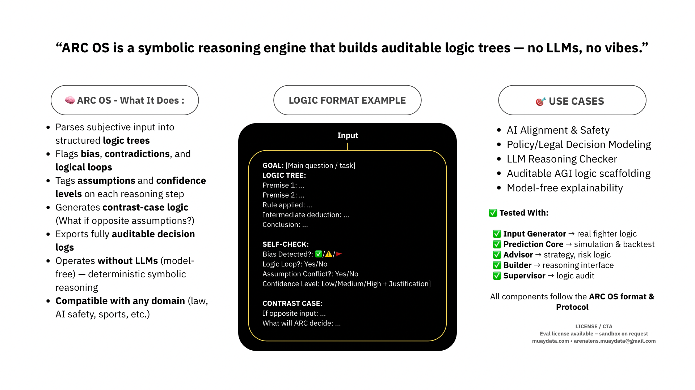

# ARC OS Reasoning Framework

This package includes the core reasoning stack developed under the ARC protocol design:  
- Layer 1: Input Normalization (Muay Glasses) | Normalize data into Number
- Layer 2: Prediction Structure (Seannoi Core)  | This not Prediction its Logic tilt %
- Layer 3: Meta-Intent Oversight (Advisor Layer) | Audit Layer 1 and 2
- Logic Renderer: ARC Builder | Unique Layer that can really generate, create for that ai and human can talk to language that each other understand and auditable
- Meta-Layer Audit Builder : ARC Supervisor
- Snapshots: Real use case simulations (ElonGov, Grok) | You can remap field like this or put Layer 1/2 and this Snapshot to ARC Builder to help you remapping field

Video Demo

Every single file had role and unique Its easier to ask your LLM how its work after you uploaded, paste or attach spec to LLM

I can tell you that all of these can structure on every or most AI model, Agent or whatever you want because its logic framework for transparency | all of these can work and deployed, its in early stage maybe not user-frienly but you can try ❤️

Each file is licensed individually and collectively under LICENSE.md.  
To deploy, use, or embed this logic protocol into any public system, written permission is required.

## Author
- Email: arenalens.muaydata@gmail.com  
- X (Twitter): @autononthagorn  
